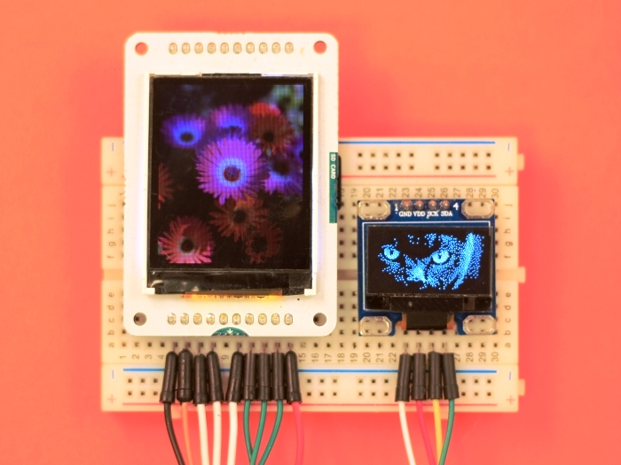
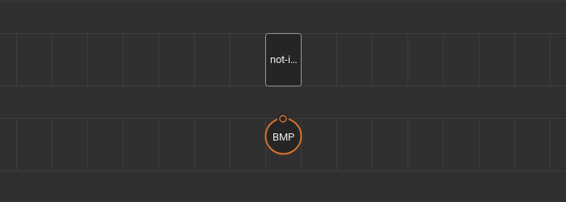
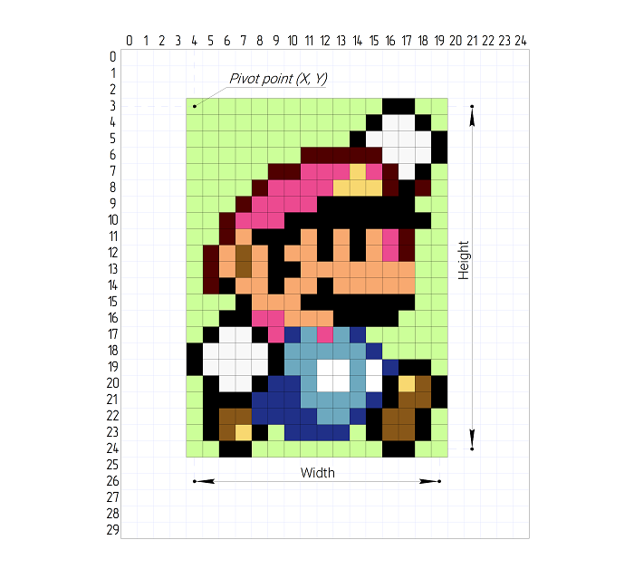
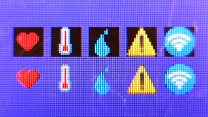
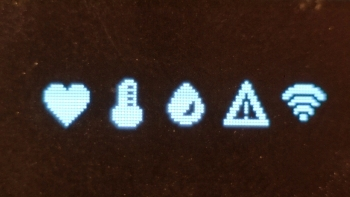
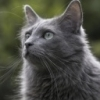
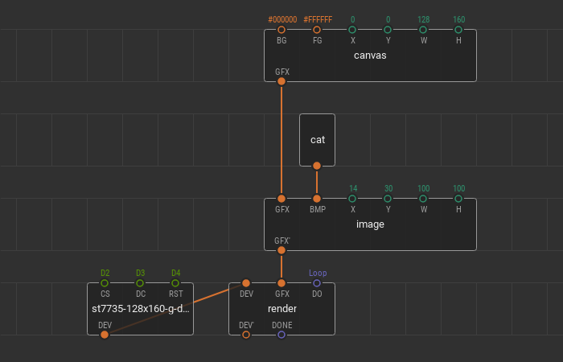
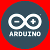

# Images in XOD



With the [graphics library](/docs/guide/graphics-library), you can display various images and icons on your display screen.

By now, [`xod/graphics`](https://xod.io/libs/xod/graphics) supports only one way to display images. It is reading [bitmap](https://en.wikipedia.org/wiki/Bitmap) images stored as bitmap arrays of pixel data in the [nonvolatile flash memory](https://playground.arduino.cc/Learning/Memory/) of the microcontroller.

## Bitmap node

In XOD, any bitmap image is a node. 



This node has a patch with the output terminal of the `Bitmap` type. And the `not-implemented-in-xod` marker node with the following template C++ code inside:

```cpp
static const unsigned char bitmap[] PROGMEM = {};

struct State {
    uint8_t mem[sizeof(Bitmap)];
    Bitmap* myBitmap;
};

void evaluate(Context ctx) {
    auto state = getState(ctx);
    state->myBitmap = new (state->mem) Bitmap(bitmap, colorDepth, width, height, keyColor);
    emitValue<output_OUT>(ctx, state->myBitmap);
}
```
A new image is created by calling `state->myBitmap = new (state->mem) Bitmap(bitmap, colorDepth, width, height, keyColor);` constructor which awaits five parameters:
- `bitmap`, a pointer to the raw bitmap array of the image;
- `colorDepth`, an integer value that sets the color depth of the bitmap image. It can be `0` - black and white image, `1` - color image, and `2` - color image with the key color specified;
- `width`, a width of the bitmap image in pixels;
- `height`, a height of the bitmap image in pixels;
- `keyColor`, a two-byte value of the color mask of the image. This parameter is specified if the `colorDepth` value is `2`. If there is a color mask, pixels of the image with the specified color are not rendered. The color mask makes it possible to display bitmap images of any geometric shape.

Images can be color or black and white, depending on the color depth of your display. The color image is stored as a byte array where each pixel is represented by two-byte (RGB565) color value in the form of `RRRRRGGG:GGGBBBBB`. Black and white images are byte arrays either, but here each pixel has its bit, and the pixel color (white or black) determined by the state of bit (0 or 1).

## Image node

To render a bitmap node, use the `image` node.


The `image` node defines a rectangular shape area on a [canvas](/docs/guide/graphics-library#canvas). During the rendering process, this area fills up with the specified bitmap image. The area is set on canvas by a pivot point (`X`, `Y`), which is its upper-left vertex, width `W`, and height `H`. By `GFX` pins, the `image` node takes a part of the tree of graphic elements of the scene as well as other graphic nodes in the [graphics library](/docs/guide/graphics-library). A `BMP` pin of the `Bitmap` type. This pin links the `image` node to a specific bitmap that should be rendered.



If the actual geometric dimensions of the image stored in the bitmap array are larger than the specified area, then only a part of the image is displayed on the screen. On the other hand, the image area is tiled with the original bitmap if the specified area is larger than the bitmap size.


## Embedded icons set

The [graphics library](/docs/guide/graphics-library) has a small set of example icons to get acquainted with the bitmaps.

Ten 16x16 color icons, five of them with the `colorDepth` equal `2` and `0x0000` color mask:



- The "Heart" icon. `heart-16x16-rgb` and `heart-16x16-rgba` with mask color;
- The "Temperature" icon. `temperature-16x16-rgb` and `temperature-16x16-rgba` with mask color;
- The "Humidity" icon. `humidity-16x16-rgb` and `humidity-16x16-rgba` with mask color;
- The "Warning" icon. `warning-16x16-rgb` and `warning-16x16-rgba` with mask color;
- The "Wi-Fi" icon. `wifi-16x16-rgb` and `wifi-16x16-rgba` with mask color.

Five 16x16 black and white icons: 



- The "Heart" icon. `heart-16x16-bw`;
- The "Temperature" icon. `temperature-16x16-bw`;
- The "Humidity" icon. `humidity-16x16-bw`;
- The "Warning" icon. `warning-16x16-bw`;
- The "Wi-Fi" icon. `wifi-16x16-bw`.

You can study the structure of these icons to create your images.

## Making own bitmap node

How to create your own `Bitmap` node for an icon or image? Let's assume that you want to make a node containing the 100x100 pixels image of a cat. 

First of all, make a new patch for the image and name it, for example `cat`. Put the `not-implemented-in-xod` node and `output-bitmap` node from the `xod/graphics` library onto the patch. Edit the `not-implemented-in-xod` node. Use the C++ [template code](#bitmap-node) above as the starting point.

Find the source image and resize it to dimensions you need using a computer. In this example, the source image is a `.JPG` file.



Now you need to convert the source image file to a byte array of pixel data. It is tough to do this manually, so many ready-made online web services are offering such features. For example [littlevgl.com](https://littlevgl.com/image-to-c-array) or [digole.com](https://www.digole.com/tools/PicturetoC_Hex_converter.php). In XOD, color images have a resolution of 2 bytes per pixel (565 color), so select the correct conversion format.

After converting, you get a long sequence of bytes. This sequence is your converted image. Put this sequence in the `static const unsigned char bitmap[] PROGMEM = {};` C++ array value in the node implementation.

```cpp
static const unsigned char bitmap[] PROGMEM = {
    0x42,0x26,0x42,0x26,0x3a,0x05,0x39,0xe5,0x39,0xe5,0x39,0xe5,0x39,0xe5,0x3a,0x05,0x42,0x25,0x42,0x45,0x4a,0x65,0x52,0xa6,0x52,0xc6,0x5b,0x06,0x5b,0x26,0x5b,0x26,0x63,0x26,0x63,0x26,0x5b,0x06,0x5b,0x26,0x5b,0x06,0x5b,0x06,0x5b,0x27,0x5b,0x27,0x63,0x47,0x63,0x28,0x63,0x48,0x6b,0x67,0x6b,0x66,0x6b,0x67,0x6b,0x88,0x6b,0xa8,0x6b,0xa7,0x6b,0x87,0x6b,0x87,0x6b,0x88,0x6b,0x87,0x6b,0x87,0x6b,0x88,0x6b,0x88,0x63,0x67,0x63,0x47,0x5b,0x27,0x5b,0x07,0x52,0xe6,0x52,0xc6,0x52,0xa6,0x4a,0x85,0x4a,0x85,0x4a,0x65,0x42,0x45,0x42,0x45,0x42,0x45,0x4a,0x65,0x4a,0x86,0x4a,0xa6,0x52,0xa6,0x52,0xa6,0x52,0xa6,0x4a,0xa6,0x4a,0x86,0x4a,0x65,0x4a,0x65,0x42,0x45,0x42,0x25,0x39,0xe5,0x39,0xc4,0x31,0xc4,0x31,0xa4,0x29,0xa4,0x31,0xa4,0x42,0x27,0x6b,0x6d,0x94,0x72,0x84,0x10,0x73,0x6d,0x6b,0x4c,0x8c,0x30,0x94,0x71,0x5a,0xca,0x42,0x27,0x31,0xe5,0x29,0xa4,0x31,0xa4,0x31,0xa4,0x31,0xc5,0x31,0xc4,0x31,0xe5,0x39,0xe5,0x39,0xe5,0x3a,0x05,0x42,0x26,0x42,0x46,0x42,0x67,0x4a,0x67,0x4a,0x87,0x4a,0xa7,0x4a,0x87,0x4a,0x87,0x4a,0x87
    // Part of the sequence is hidden for readability
    ,0x18,0xe3,0x18,0xe3,0x18,0xe3,0x18,0xe3,0x21,0x03,0x21,0x24,0x29,0x44,0x29,0x64,0x29,0x65,0x29,0x85,0x31,0x85,0x39,0xc6,0x42,0x27,0x4a,0x48,0x4a,0x89,0x52,0x89,0x52,0x89,0x52,0xca,0x5b,0x0b,0x73,0x8d,0x84,0x30,0x9c,0xf3,0xad,0x54,0xb5,0x96,0xb5,0x96,0x9c,0xd3,0x8c,0x31,0x73,0x8e,0x63,0x0c,0x5a,0xeb,0x62,0xec,0x5a,0xab,0x4a,0x28,0x39,0xc7,0x31,0xa6,0x39,0xc6,0x39,0xc7,0x39,0xe7,0x31,0xa6,0x31,0x86,0x31,0x85,0x21,0x04,0x18,0xe3,0x29,0x45,0x29,0x45,0x18,0xe3,0x18,0xc2,0x18,0xc3,0x18,0xe3,0x18,0xe3,0x29,0x44,0x18,0xe3,0x18,0xc3,0x10,0xa2,0x18,0xe3,0x21,0x04,0x18,0xc3,0x21,0x04,0x21,0x24,0x21,0x24,0x21,0x04,0x21,0x04,0x18,0xc3,0x18,0xe3,0x21,0x04,0x21,0x04,0x21,0x24,0x21,0x04,0x21,0x24,0x31,0x86,0x21,0x24,0x18,0xe3,0x18,0xc3,0x21,0x04,0x29,0x65,0x29,0x65,0x31,0x86,0x31,0x86,0x31,0x86,0x29,0x65,0x31,0x86,0x31,0x86,0x31,0xa6,0x31,0x86,0x21,0x04,0x21,0x04,0x31,0x86,0x39,0xc7,0x39,0xe7,0x39,0xc7,0x39,0xc7,0x39,0xe7,0x31,0xa6,0x29,0x45,0x21,0x24,0x31,0x86,0x39,0xe7,0x4a,0x49,0x52,0xaa,0x52,0x8a
};
```

Then set the necessary parameters in the bitmap constructor. The first parameter, a pointer to the array, can be left untouched. The second parameter is `colorDepth`. We have a color image without a color mask, so choose `1`. The third and fourth parameter defines bitmap width - `100` pixels and height - `100` pixels. We can skip the fifth parameter because we don't use the color mask.

```cpp
void evaluate(Context ctx) {
    auto state = getState(ctx);
    state->myBitmap = new (state->mem) Bitmap(bitmap, 1, 100, 100);
    emitValue<output_OUT>(ctx, state->myBitmap);
}
```

That it! The node with the image is ready. 

<div class="ui segment note">
<span class="ui ribbon label">Note</span>
It is worth calculating how much space the image takes up in the controller's flash memory. 

- For a color image; Find out the total number of pixels (bitmap width * bitmap height) and multiply it by two since, in XOD, a colored pixel is stored as a two-byte (RGB565) color.
- For a black and white image; First, calculate how many bytes a single row of pixels takes up. In a black and white image, pixels are stored in bits. Divide the image width by eight and round the result to a larger integer. Multiply the rounded value by the image height.

For example, the `cat` bitmap is a color image that is `100` pixels wide and `100` pixels high. Let's calculate how much space this image takes in memory, 100 × 100 × 2 = 20 KB of flash memory. It is a huge chunk, and you can't display such an image on the Arduino Uno. But for high capacity controllers as Arduino Mega 2560 or ESP8266 controllers, it is suitable.
</div>

Let's show the created image on the [ST7735 display](/docs/guide/st7735-display) screen. For this, create a new patch and put the `st7735-128x160-g-device` and `render` nodes from the `xod-dev/st7735-display`library. Then make a tree of graphic elements. Put the `canvas` and `image` nodes from the `xod/graphics` library. Set up canvas width to `128` pixels and height to `160` pixels to fit the device screen. Link the created bitmap `cat` node with the `BMP` pin of the `image` node. Set the width and height of the `image` field to `100` pixels. Put the `image` in the middle of the `canvas`. For this, set the coordinates of the upper-left corner of the image to (`14`, `30`).



Upload the patch and look at screen.


## Color masking

Now let's try to make and display the image with a color mask. As a source file, we use the color Arduino logo 100x100 pixels.



As you can see, this image has a red color (`#FF0000`) along the outline of the logo. It's the color that we use as a mask, making red part of the image "invisible" on the display screen. 

Create one more `bitmap` image node and name it `logo`. Convert the source file to the array of bytes as we did making the `cat` node. But this time, we change some parameters in the `Bitmap` constructor.

```cpp
void evaluate(Context ctx) {
    auto state = getState(ctx);
    state->myBitmap = new (state->mem) Bitmap(bitmap, 2, 100, 100, 0xF800);
    emitValue<output_OUT>(ctx, state->myBitmap);
}
```

If we want to make an image with a mask, we set the `colorDepth` value to `2`. At the last constructor parameter, we specify the two-byte `keyColor` of the mask, which is `0xF800`. This color corresponds to the pure red RGB color `#FF0000`.

Let's expand our previous patch to display images on the [ST7735](/docs/guide/st7735-display) screen.

Change the `BG` background color of the scene on the `canvas` node. For example, to the `#FF00FF` pink. It gives us a better view of the outline of the masked image on the screen. Add the `logo` image node onto the patch. Also, add the `button` and [generic](/docs/guide/generics) `if-else` node. Link the nodes, as shown below. 


By clicking on the `button`, we are going to change the image in the center of the screen. From the `cat` image to the `logo` with a color mask. Upload the patch to the microcontroller and take a look at the result.

<video controls autoplay muted loop>
    <source src="./manage-images-with-button.mp4" type="video/mp4">
</video>

---

- Create and render different bitmap images on your display devices, but ensure that your MCU has enough memory for that.
- Use black and white images for black and white displays like [SSD1306 display](/docs/guide/ssd1306-display/) or to optimize the memory usage on the low memory microcontrollers.
- Color images can have a color mask. Create images with masks to achieve different visual effects.
