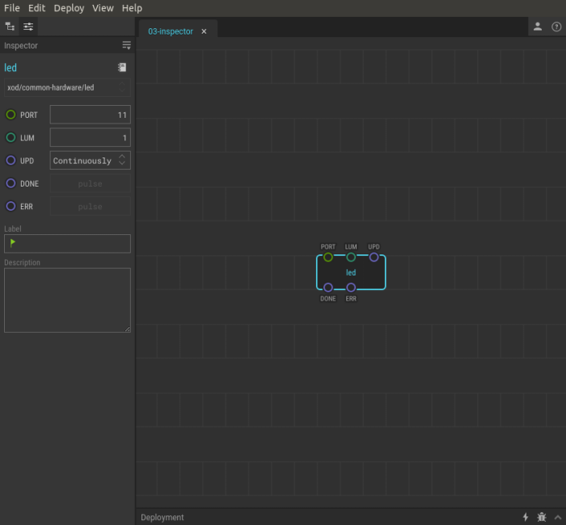

# #03. Пины, данные, и Инспектор

Примечание
Это веб-версия обучения, встроенная прямо в XOD IDE.
Для удобства обучения, мы рекомендуем установить
<a href="/downloads/">desktop IDE</a> или открыть
<a href="/ide/">browser-based IDE</a>, и вы увидите тот же учебник.

Ноды представляют собой визуальное представление некоторого физического
устройства (например, портов на Arduino) или некоторой функции (добавление,
вычитание или более сложные функции).

`led` - это простая нода управления светодиодом. Данная нода может управлять
только одноцветным светодиодом. У ноды есть входные контакты `PORT` и `LUM` , а
также несколько других контактов, которые вы можете игнорировать.

## Пины

Маленькие цветные круги на узлах называются _pins_ (пины). Пины разделены на
входы и выходы. Входы всегда находятся на верхней стороне узлов, выходы - на
нижней.

Пины используются для передачи данных между нодами. Ноды обрабатывают эти
значения и выполняют какие-либо действия или выводят результат. В этом примере
нода `led` передает значение led brightnes (устанавливается в `LUM`) на порт
Arduino (устанавливается в `PORT`).

Вы можете изменить значения контактов с помощью боковой панели с именем
_Inspector_. Инспектор можно найти слева под списком проектов.

## Схема

Схема такая же, как и в предыдущем уроке.

[↓ Скачать Fritzing проект](./circuit.fzz)

## Как использовать

1.  Кликните на ноду, в которой вы хотите изменить значения пинов. В нашем
    примере это нода `led`. Таким образомы мы выбрали ноду.
2.  В Инспекторе измените нужные значения.
3.  Загрузите в плату патч еще раз, чтобы применить изменения.

